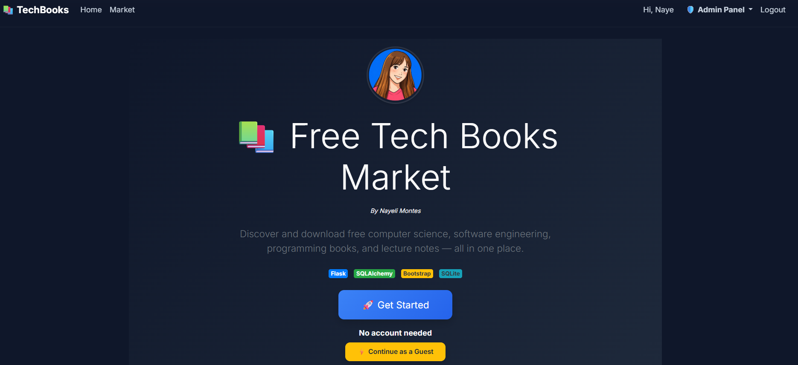
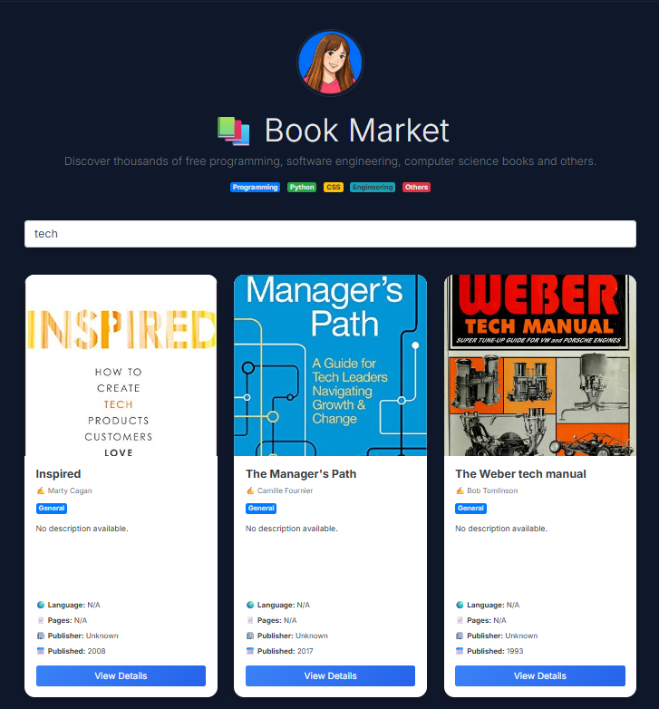
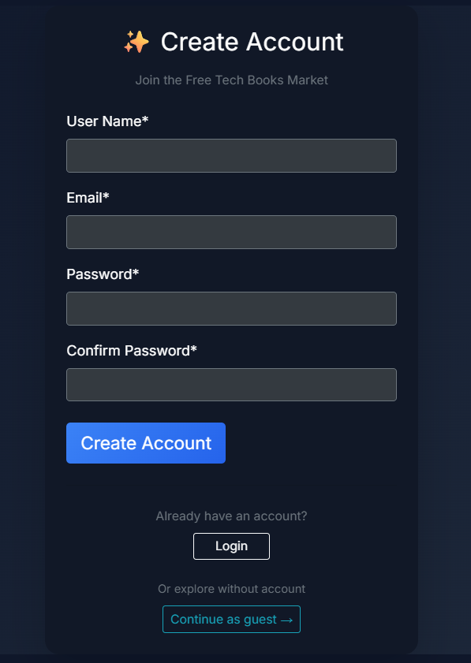
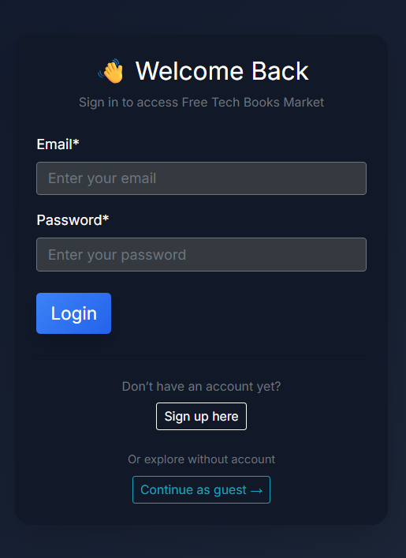

Book Market by Nayeli 📚
-----

## Introduction

Free technology Books Market

This site lists free download computer science, software engineer and programming books, textbooks and lecture notes, cheat sheet, all of which are freely available.

Full stack flask project.


## Tech Stack (Dependencies)

### 1. Backend Dependencies
Our tech stack will include the following:
* **virtualenv** as a tool to create isolated Python environments
* **Python3** and **Flask** as our server language and server framework
* **SQLAlchemy ORM** to be our ORM library of choice
* **SQLite** as our database of choice
* You can download and install the dependencies mentioned above using `pip` as:
```
alembic==1.13.0
bcrypt==4.1.1
blinker==1.7.0
click==8.1.7
colorama==0.4.6
dnspython==2.4.2
email-validator==2.1.0.post1
Flask==2.0.3
Flask-Admin==1.6.0
Flask-Bcrypt==1.0.0
Flask-Cors==3.0.10
Flask-Login==0.6.0
Flask-Migrate==4.0.5
Flask-SQLAlchemy==2.5.1
Flask-WTF==1.0.0
greenlet==3.0.1
idna==3.6
itsdangerous==2.1.2
Jinja2==3.1.2
Mako==1.3.0
MarkupSafe==2.1.3
six==1.16.0
SQLAlchemy==1.4.41
typing_extensions==4.8.0
Werkzeug==2.2.2
WTForms==3.1.1
```

### 2. Frontend Dependencies
You must have the **HTML**, **CSS**, with [Bootstrap 4](https://getbootstrap.com/) for our website's frontend. 


## Development Setup

1. **Initialize and activate a virtualenv using:**
```
py -3 -m venv venv 
source app\Scripts\activate.bat
```

2. **Install the dependencies:**
```
pip install -r requirements.txt
```

3. **Run the development server:**
```
In Bash
export FLASK_APP=run.py
export FLASK_ENV=development # enables debug mode
flask run --reload 

In Windows
set FLASK_APP=run.py
set FLASK_ENV=development # enables debug mode
flask run --reload 
```

4. **Verify on the Browser**<br>
Navigate to project homepage [http://127.0.0.1:5000/](http://127.0.0.1:5000/) or [http://localhost:5000](http://localhost:5000) 


## 💻 Tech Stack

**Client:** HTML, CSS, Javascript, Bootstrap

**Server:** Python, Flask

## 🛠 Skills
HTML, CSS, Javascript, Bootstrap, Python, Flask


## 👤 Author

- [@NayeMontes](https://github.com/NayeMontes/nayeli-montes)

## 💬 Feedback & Contact

Your feedback is highly appreciated! You can contact me through:

* ✉️ **Email:** [nayeli.montes@hotmail.com](mailto:nayeli.montes@hotmail.com)
* 💼 **LinkedIn:** [Nayeli Montes](https://www.linkedin.com/in/nayeli-montes/)


## 🖼️ Screenshots

### Home page 



### Market page 



### Register page 



### Login page 

